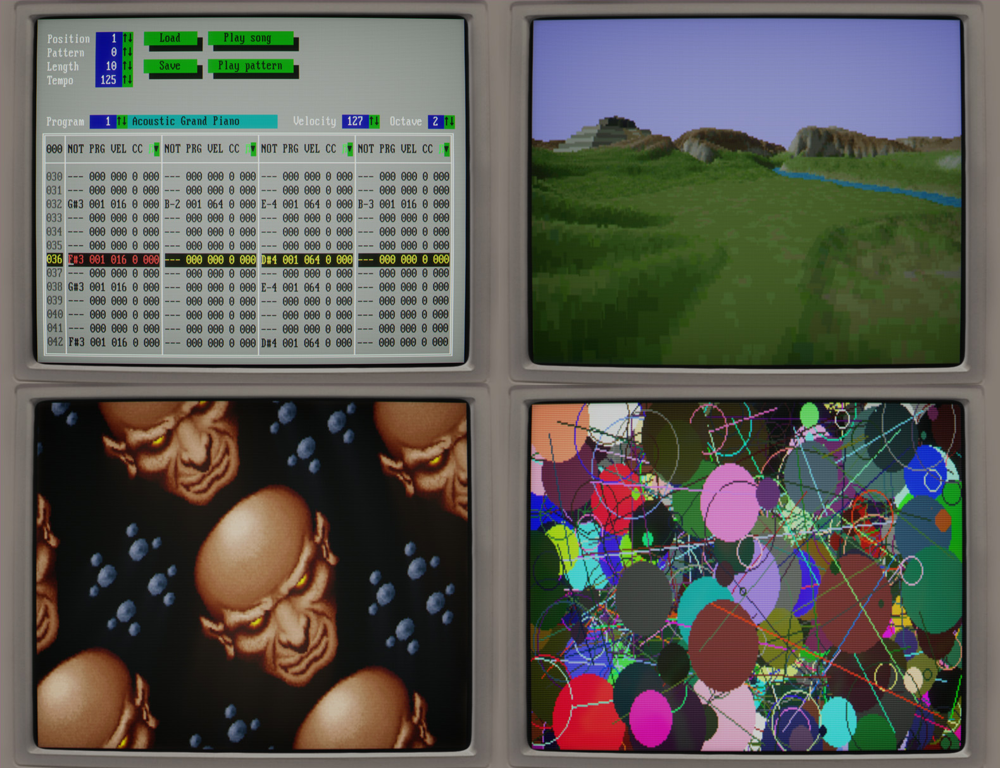

# dos-like



dos-like is a programming library/framework, kind of like a tiny game engine, for writing games and programs
with a similar feel to MS-DOS productions from the early 90s. But rather than writing code that would run on
a real DOS machine, dos-like is about making programs which run on modern platforms like Windows, Mac and
Linux, but which attempts to recreate the look, feel, and sound of old DOS programs. 

It includes a bunch of examples of classic DOS techniques and effects, a few of which can be seen above.

For more information and screenshots, please see the project home at https://mattiasgustavsson.itch.io/dos-like


## Operating

While running, you can use F11 to toggle between fullscreen and windowed mode.

To start in windowed mode, add the flag -w or --window to the commandline when launching.


## Building

dos-like does not make use of any complicated build systems - a simple command line call to the compiler is
all that is needed to build both your program and the engine itself.


### Windows

Tiny C Compiler for windows is included. To build all samples, run build_all.bat.
To build individual samples, do:
```
  tcc\tcc source\stranded.c source\dos.c
```  
where `stranded.c` should be replaced with the sample you would like to build.

Alternatively, from a Visual Studio Developer Command Prompt, do:
```
  cl source\stranded.c source\dos.c
```  
where `stranded.c` should be replaced with the sample you would like to build.


### Mac

To build all samples on Mac, run build_all_macos.sh.
To build individual samples, do:
```
  clang source/stranded.c source/dos.c `sdl2-config --libs --cflags` -lGLEW -framework OpenGL -lpthread
```
where `stranded.c` should be replaced with the sample you would like to build.

SDL2 and GLEW are required - if you don't have them installed you can do so with Homebrew by running
```
  brew install sdl2 glew  
```


### Linux

To build all samples on Linux, run build_all_linux.sh.
To build individual samples, do:
```
  gcc source/stranded.c source/dos.c `sdl2-config --libs --cflags` -lGLEW -lGL -lm -lpthread
```
where `stranded.c` should be replaced with the sample you would like to build.

SDL2 and GLEW are required - if you don't have them installed you can do so on Ubuntu (or wherever `apt-get` is available) by running
```
  sudo apt-get install libsdl2-dev
  sudo apt-get install libglew-dev
```


### WebAssembly

To build all samples for WebAssembly, run build_all_wasm.bat.
To build individual samples, do:
```
  wasm\node wasm\wajicup.js source/burn.c source/dos.c out.html
```
where `burn.c` should be replaced with the sample you would like to build.

You can embed asset files in the process with the -embed parameter. 
For examples of this, see the file [build_all_wasm.bat](build_all_wasm.bat)

A WebAssembly build environment is required. You can download it (for Windows) here: [releases/tag/wasm-env](../../releases/tag/wasm-env).
Unzip it so that the `wasm` folder in the zip file is at your repository root. Note that if you downloaded dos-like from itch.io, the wasm
build environment is already included.

The wasm build environment is a compact distribution of [node](https://nodejs.org/en/download/), [clang/wasm-ld](https://releases.llvm.org/download.html),
[WAjic](https://github.com/schellingb/wajic) and [wasm system libraries](https://github.com/emscripten-core/emscripten/tree/main/system).
